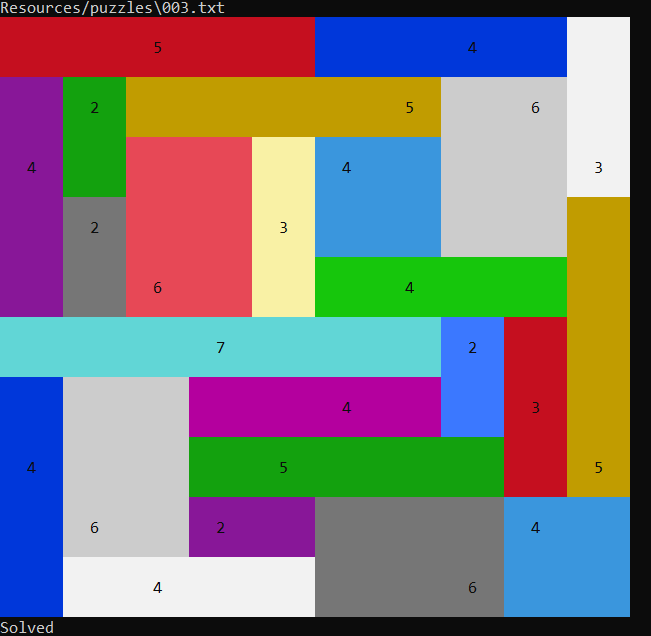
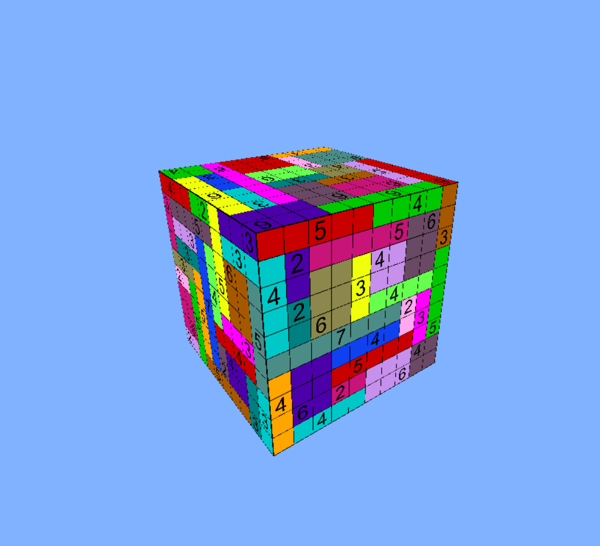

# Shikaku
### Интерактивная головоломка
Версия 1.0
Автор: Даниил [JazzMutant](https://t.me/JazzMutant) Толстоухов

## Описание
Данное приложение является реализацией игры Shikaku и поддерживает несколько режимов.

## Правила игры
https://en.wikipedia.org/wiki/Shikaku

## Режимы работы
Перед запуском убедитесь, что у вас установлены необходимые библиотеки. 
Для этого можно выполнить команду `pip install -r requirements.txt`

- **Консольный (по умолчанию)**   
    
    
    Программа решит все головоломки из папки `Resources/puzzles`
    
- **3D**

    
     
    Программа предложит решить пользователю головоломки на трехмерном кубе. 
    Для использования этого режима, при запуске необходимо указать ключ `--cube` в качестве аргумента. 
    Головоломки находятся в папке `Resources/cube_puzzles`

## Состав
- Приложение: `shikaku_solver.py`
- Модули решателя: `Solver/`
- Модули графики: `Form/`
- Вспомогательные модули: `Utilities/`
- Ресурсы: `Resources/`
- Тесты: `tests/`

## Требования
    Python 3.x
    pyglet
    Pillow
    colorama

## Управление в режиме 3D
Для того, чтобы начать решать головоломку, подлетите к нужной грани на развертке куба. 
После чего откроется новое окно с этой головоломкой. После решения вы можете вернуться и выбрать другую грань куба.
Когда все грани будут решены, вы можете перейти к следующему кубу.

**WASD** - Перемещение

**Shift** - Опуститься

**Space** - Подняться

**ЛКМ** - Закрашивание прямоугольниика

**Esc** - Выйти из режима решения / Перейти к следующему кубу

## Формат записи головоломок
Головоломки хранятся в файлах с расширением `.txt`.

- **Плоский режим.** В первой строке через пробел указываются высота и ширина поля.
    В последующих строках через пробел указываются символы: `-` для пустой клетки и число для указания необходимой площади прямоугольника.
    Пример:
    
        3 4
        - 4 - -
        - - 3 -
        2 - - 3
    
- **Режим куба.** В первой строке указывается размер поля. В последующих строках прописываюся грани куба в формате плоской головоломки без указания ширины и высоты. Между гранями оставляется пустая строка.
    Пример:
    
        3
        2 - 3
        4 - -
        - - -
        
        - 3 -
        2 2 - 
        - 2 -
        
        2 - -
        - 2 3
        3 - -
        
        - 3 -
        2 - 2 
        - 2 -
        
        2 2 2
        - - -
        - - 3
        
        - - -
        6 - 3
        - - -
    
    
    ​    
## Стадии разработки
- [x] Консольный решатель
- [x] Цветной вывод решения в консоль
- [x] Вывод решения на 3D уб
- [x] Возможность пользователю решать головоломку

## Подробности реализации
В папке `Solver/` лежат модули, отвечающие за логику. `solver.py` отвечает за нахождение решения на поле, представленным классом `game_board.GameBoard`.
Игровое поле хранит в себе изначальное состояния, текущее состояние и все клетки с цифрами (т.н. блоки), которые должны содержаться в прямоугольниках.  
`cube_game_board.CubeGameBoard` представляет собой обертку, содержащюю в себе 6 обычных `GameBoard`.
Блоки представлены классом `block.Block` и хранят в себе свое расположение на поле, значение и список делителей (необходимы для реализации алгоритма поиска решения).
Решение головоломки находится перебором.

В папке `Utilities/` лежат вспомогательные модули:
- `point.py` - двумерная точка, необходима для определения прямоугольника.
- `rectangle.py` - Прямоугольник на поле. Необходим для закрашивания участка поля. Умеет находить ненулевое значение, принадлежащие этому прямоугольнику
- `texture_factory.py` - модуль, генерирующий текстуру решения в формате `.png`. Сохраняет текстуры в папку `Resources/textures`
- `texture_loader.py` - модуль, загружающий текстуру из `.png` в память в формате `pyglet.graphics.TextureGroup`
- `colors.py`, `texture_colors.py` - цвета, необходимые для визуализации решения в консоли и создания текстур.
    
`Form/` содержит в себе модули, необходимые для визуализации 3D режима. Основным является класс `window.Window`, он управляет всеми остальными классами.
`game.Game` Представляет собой отдельное окно, в котором пользователь может решать головоломку, представленную в плоском режиме.
`player.Player` отвечает за движение игрока. `cube_face.CubeFace` - модуль, рисующий одну грань куба, подлетев к которой начнется игра.
`square.Square` - вспомогательный модуль, отдельная ячейка поля на плоскости. Используется для визуализации текущего состояния головоломки.
`cube.Cube` - трехмерный вращающийся куб. Каждый тик он пересчитывает свои координаты, тем самым вращаясь по заданному правилу.
При создании объекта этого класса можно указать флаг, отвечающий за вращение. Внутри класса можно найти пасхалку.

На основные модули написаны тесты. Найти их можно в папке `tests`

    --------------------------------------------------
    Name                           Stmts   Miss  Cover
    --------------------------------------------------
    Solver\block.py                   18      0   100%
    Solver\cube_game_board.py         28      1    96%
    Solver\game_board.py              87     19    78%
    Solver\solver.py                  37      4    89%
    Utilities\point.py                19      1    95%
    Utilities\rectangle.py            34      3    91%